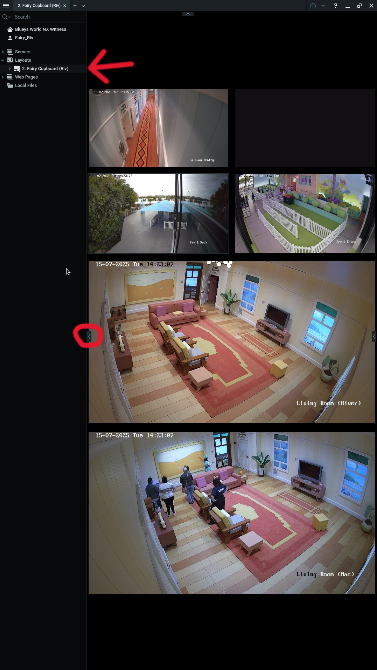

# 3.1 / Venue Opening Procedures

## 🏛 Pavilion 1

🎛️ 1. Control Room

* 📻 **Radios:**
  * Switch ON:  (CHECK Channel is SET)
    * `CH2`: FOH / Box Office
    * `CH4`: Tech / Experience&#x20;
* **🪩 Distros:**
  * Located in rack at far end of room
  * Switch **ON all breakers** on **all x3 distros**
* **💡Work Lighting:**
  * Use Showtouch tablet or touch screen mounted to wall (Alcorn McBride screen)&#x20;
  * Screen should be on _Version 2 Operations Centre_ _(Version 1 Operations not longer in use_)  **\[**&#x56;2OPS] If not → Click and hold on blank grey area for x3 seconds to open Showtouch main menu → Click on `Select Panel` → Select `Connect` (allow server to load) → Select `Next` → Select `Version 2 Operations Centre` **\[**&#x56;2 OPS] **(or** appropriate panel) → Select `Next`
  * Via **Show Control OPS Panel** → Select `Technical` → Select `Lighting`
  *   Activate:

      * `Pav1 Work`
      * `Pav2 Work`

* **📹 CCTV + Show Control Panel:**
  * Collect TV remote → from black shelves upon entry (4th shelf)
  * Turn TV ON with remote
  * Open `NX Witness` from desktop
  * Select server- **Bluey's World NXWitness**&#x20;
  * A pre- selected layout will launch (Click on grey arrow `<` on left handside to open full camera and layout list)&#x20;
    * Select `Layouts`tab
    * Select `Tech Control` tab

-   &#x20;**🖥️ OPS Panel Setup on Experience Screen:**

    **Using "Show Control" Monitor**

    * Open OBS from desktop
    * Open **BOH view panel** via:
      * `Show Touch` app or
      * `Winscript` → Tools → Show Touch → Select `BOH View`&#x20;
- Confirm panel displays OBS screen (BOH view panel) on NXWitness Experience screen
- If not displaying:
  * Open Task Manager → End `OBS.exe` and `Show Touch` → Relaunch show touch and OBS → Check in **Sources** tab (bottom left hand corner)- Select `Window Capture 2` → Check in Window bar- Select `[ShowTouch.exe]:TouchViewer-Run` → resize the tab to fit screen

> 🖱 **TV Mouse**: Use the mouse labeled “TV” on desk.

🧚‍♀️ 2. Cubby Nook, Fairy Cupboards (MacArthur + Riverside), Living Room Nooks (MacArthur + Riverside)

**Distros:**\
Turn ON all breakers

<table><thead><tr><th>Area</th><th width="237">Elements Powered</th><th>Breaker Location</th></tr></thead><tbody><tr><td><strong>Entrance</strong></td><td>Sky Cyc, LX boxes x4, Porch Light, Go photo (Note: Turn on Gophoto tower manually- refer to Gophoto start up procedure)</td><td>Fairy Cupbaords (MacArthur side + River side) </td></tr><tr><td><strong>Entrance Hallway</strong></td><td>Niche LED strip light (Note: Double check the motion sensors are activating by walking past)</td><td>Living room Distro (Macside)</td></tr><tr><td><strong>Fairy Cupboards</strong></td><td>Nook lights, fans, TVs <em>(Note: Double check Fairy Cupboard TVs- manual power-on and NXWitness troubleshooting may be needed- see below)</em> </td><td>Fairy Cupboard Distro (MacArthur side + River side) </td></tr><tr><td><strong>Living Rooms</strong></td><td>LX boxes and TVs (Note: After the breakers are on turn on the TVs with remote before continuing to next room, check prop TV by using prop remote- ch1,3,4,5- then turn it back to black- ch2)</td><td>Living Room Distro (MacArthur side + River side) </td></tr><tr><td><strong>Riv Cubby</strong></td><td>All Rivside Cubby- LX Boxes, Penguins, dining area, gnome party, TVs and red buttons (Note: After breakers are on turn on the TVs with remote before continuing to next room)</td><td>Bottom Distro Riverside Living room Nook</td></tr><tr><td><strong>Mac Cubby</strong></td><td>All Macside Cubby- LX Boxes, Penguins, dining area, gnome party, TVs  and red buttons (Note: After breakers are on turn on the TVs with remote before continuing to next room)</td><td>Bottom Distro Cubby Nook</td></tr><tr><td><strong>Chattermax</strong></td><td>LED dance floor </td><td>
Breaker 1 on Aggreko distros-
<ul><li><strong>Control Room:</strong> Bottom shelf unit at entry</li></ul><ul><li><strong>Cubby Nook:</strong> Top of 2nd rack, far-right corner</li></ul></td></tr><tr><td><strong>Playroom</strong></td><td></td><td></td></tr><tr><td><strong>Blueys Kitchen</strong></td><td></td><td></td></tr></tbody></table>

*   **🔧 Troubleshooting NXWitness Fairy cupboard:**

    * _NXWitness Riverside -_ Click on desktop shortcut 'NxWitness- Client 6.0.3.4'
      * Click lefthand side arrow `<`, Select  `Layers`, in the dropdown menu select  `Fairy Cupboard Riv`
      * Click on lefthand side arrow `<` to minimise menu (the top arrow `<` can also be clicked on to minimise the tab menu), the TV is now ready for experience

    
<figure><figcaption></figcaption></figure> <figure><figcaption></figcaption></figure> <figure><figcaption></figcaption></figure>

    * _NxWitness Macside_ - Click on desktop shortcut 'NxWitness'
      * Click lefthand side arrow `<`, Select  `Layers`, in the dropdown menu select  `Fairy Cupboard Mac`
      * Click on lefthand side arrow `<` to minimise menu (the top arrow `<` can also be clicked on to minimise the tab menu), the TV is now ready for experience

<figure><figcaption></figcaption></figure> <figure><figcaption></figcaption></figure> <figure><figcaption></figcaption></figure>

🔔 3. Test Call Buttons

* On **wall-mounted iPads** in each room
  * Press **Test Call**
* On Show Touch Panel:
  * Tap **"Received"**&#x20;

> 📝 _Must be completed before first show to clear messages and avoid confusion._

📺 4. Turn On TVs

**Remotes Needed:**

* TCL TV Remote
* Panasonic Projector Remote
* Prop remote

**🛋 Living Rooms – 3x TVs:**

* Select: HDMI 1
* Test Sprite box function using Prop Remote (behind TV):
  * Test Channels: 3, 4, 5, 6
  * Leave on Channel 2 (black screen for mock-off)
* Remote aim points:
  * Window TV: Aim at centre right
  * Prop TV: Aim at lower centre

⛺ **Cubby TVs – 4x per cubby:**

* Select: HDMI 1
* Remote aim points:
  * Throne Room: RHS behind panel gap around back of cubby panelling and wall
  * Prop TV: Slightly pull centre bottom-left purple panel, aim downward in gap
  * Chilli: Between panelling and wall on LHS or centre-left in porthole close to screen
  * Toilet: LHS above and behind toilet cubby paneling

🔇 Mute Chilli TV — unmute at \~8:30 AM (the audio loop is annoying)

**🛏 Bedrooms – 1x TV each:**

* Select: HDMI 4
* Remote aim point: Centre of window frame

🎥 5. Turn On All 8(?) Projectors in Chattermax

🔁 6. Return Remotes to Control Room

📱 7. Take Items into Pavilion 2

* iPad with **Show Touch OPS Panel** open
* **Tech MacBook**

## 🏛 Pavilion 2

🌠 1. Dome Nook

#### **Distros:**

* Turn ON: Work LX (Highbays) or Truss Lights (in Pav 2 Work mode) for Cleaning Team
* Turn ON: Indicated breakers on rack distros

> ⚙️ If calibrating: leave Dome LED OFF until calibration is complete

#### **Lighting:**

* **If not already on,**
  * In  ShowTouch OPS Panel → `Technical > Lighting` - Set to `Pav 2 Work`&#x20;

#### **Projectors:**

* **5x Dome Projectors**
  * Stand in centre of Dome and aim at each lens
* **7x Creek Projectors**

#### **Computers:**

* **Dome Monitor:**
  * Launch:
    * `Nestmap` (Dome projector program)
    * `Resolume` (Dome content playback)

> &#x20;⚙️ Shortcuts on desktop in `Dome PC Showfiles` box

* **Creek Monitor:**
  * Launch:
    * `MadMapper`
      * Ensure output set to `Fullscreen`
    * `Perform`

> ⚙️ Shortcuts on Creek \*is there info missing here?\*

#### Dome:

🔄 Rotate Dome content or mask as needed

* Floppy scene is to be centred between _exit archway_ and _Projector Plinth 5_

🔊 Test AV sync\
💡 Turn **ON Dome LED** after calibration

🛍️ 2. Merch Pantry Nook

**Distros:**

* Switch ON Breakers `9–11`
* Leave Breaker `12` OFF during show (Highbay LX)

🍦 3. Kitchen Rack

Turn ON if not already

* &#x20;**Ice Cream Shop TVs**
  * Displays menu and product image slideshow

🎫 4. Box Office Nook

**Turn ON**

* **External Box Office TV (Community Noticeboard):**
  * Displays postcard slideshow
* **Internal Box Office TV:**
  * Displays tourism + sponsor slideshow

- Both displays controlled by **BrightSign devices** with **Optisign** software
  * If blank screen:
    * Check Ethernet, HDMI, and 12V 1.5A power cables

* **Distros:**
  * Turn ON Box Office LX breakers
  * Turn ON all label indicated breakers

## 🏛 Whole Venue

🧪 Full Show Test Run

* Start show physically via **Living Room Button**
* Walk through each room:
  * Confirm lighting and audio cues firing correctly
  * **Test Red Buttons** in each Cubby&#x20;
    * Is audio and vision triggering?
  * Test **Gate + Shed Maglocks by**:
    * Physical press
    * Sequence triggered
    * Show Touch control
* **Also check:**
  * Chattermax triggers
  * Creek / Dome sequences

🔁 Ensure WHOLE sequence has played through seamlessly at least twice before first live show

🧯 Fix any issues before first live show and re-run until in working order

> ⚠️ _DO NOT_ press physical button within 10 minutes of first scheduled show
>
> &#x20;_- Button has been formatted to not trigger show again until 10 minute gap_

🔚 Final Pre-Show Checks

**Turn OFF highbay work Lights before first public show** ⚠️&#x20;

* **Pavilion 1:**&#x20;
  * First outside distro, left of Riverside emergency exit doors: Breaker `6`
* **Pavilion 2:**
  * &#x20;**Creek work lights:** Dome Nook distro  → `Work LX`
  * **Meet & Greet work lights:** Merch Nook: Rack distro → `Work LX`

#### **Experience Audio:**

* Must be **ON** before doors open → `Foyer ON` → `Playground ON`
* Start the audio loops in Hallway, Living Room, Cubby, Bedroom → `Start of Day`

#### **Comms:**

* Notify **Experience + FOH on `Ch.4`** when Tech is ready
  * Alert team if show needs temporary hold due to technical issue

