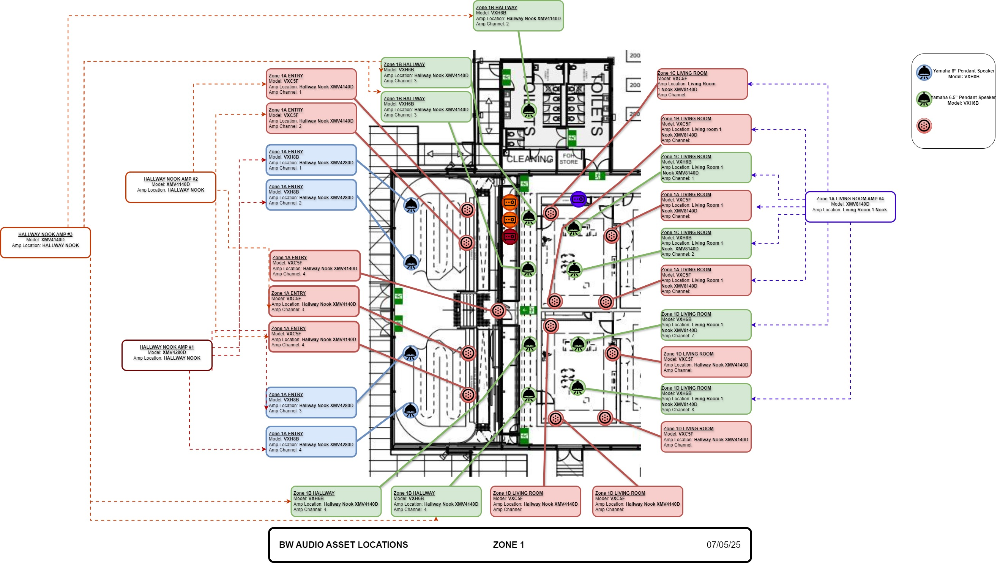

# 6.1.1 / Architecture

## System Plans



_Overview of amplifier and equipment rack locations overlaid on venue map._

_\[Insert Plan Img]_



_Speaker positions and coverage zones throughout venue._

_\[Insert Plan Img]_



_Primary audio cable paths and connection points._

_\[Insert Plan Img]_



_Playback servers and input source locations._

_\[Insert Plan Img]_



_Comprehensive view of all audio equipment and connections_

_\[Insert Plan Img]_



## Zone Plans



 _Close-up of Zone 1 audio equipment and coverage._

<figure><figcaption>
Incomplete drawing - testing
</figcaption></figure>




_Close-up of Zone 2 audio equipment and coverage._

_\[ Insert Zoom In Photo of Zone 2 ]_



 _Close-up of Zone 3 audio equipment and coverage._

_\[ Insert Zoom In Photo of Zone 3 ]_



 _Close-up of Zone 4 audio equipment and coverage._

_\[ Insert Zoom In Photo of Zone 4 ]_



 _Close-up of Zone 5 audio equipment and coverage._

_\[ Insert Zoom In Photo of Zone 5 ]_



 _Close-up of Zone 6 audio equipment and coverage._

_\[ Insert Zoom In Photo of Zone 6 ]_



 _Close-up of Zone 7 audio equipment and coverage._

_\[ Insert Zoom In Photo of Zone 7 ]_



 _Close-up of Zone 8 audio equipment and coverage._

_\[ Insert Zoom In Photo of Zone 8 ]_



## Patch List



## Schematics



_Single-line diagram showing signal paths through system_



_Processing flow and configuration within DSP systems_



_Audio network design and connection points_



_Audio system power distribution_


