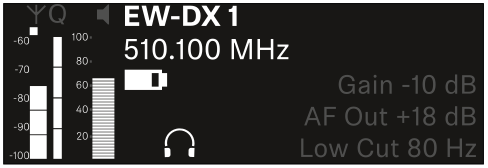

# Syncing Bodypacks.

## Syncing Bodypacks to the EW-DX EM 4 Receiver

<figure><figcaption></figcaption></figure>

Training Document: Syncing Bodypacks to the EW-DX EM 4 Receiver.&#x20;

Purpose: This guide provides step-by-step instructions for pairing Sennheiser bodypack transmitters with the EW-DX EM 4 receiver. Proper syncing ensures reliable wireless audio for all headset microphones.&#x20;

**1. Before You Start**&#x20;

Power: Ensure the EW-DX EM 4 receiver is powered on and has connected antennas.&#x20;

Bodypack: Have the bodypack transmitter ready with fresh batteries inserted. &#x20;

<figure><figcaption></figcaption></figure>

<figure><figcaption></figcaption></figure>

**2. Sync Method Overview**&#x20;

The EW-DX system uses infrared (IR) sync to transfer frequency and settings from the receiver to the transmitter. There are two ways to initiate sync:&#x20;

Single-channel sync – sync one bodypack to a specific channel.&#x20;

Multi-channel sync – sync multiple bodypacks one after another.

**3. Step-by-Step Sync Procedure**&#x20;

Step 1 – Select the Receiver Channel&#x20;

Before syncing, you must tell the receiver which wireless channel you want to use.&#x20;

Locate the channel selection controls:&#x20;

On the EM 4 front panel, each of the 4 channels has its own channel select button (a small push button) above or below its display area.&#x20;

Alternatively, you can use the encoder wheel (the large rotary knob) to navigate between channels.&#x20;

Select a channel:&#x20;

<figure><figcaption>
EW-DX EM 4
</figcaption></figure>

Press the channel select button for the desired channel (e.g., Ch 1, 2, 3, or 4). The corresponding display area will highlight, showing you are now controlling that channel.&#x20;

If using the encoder wheel, rotate it to scroll through the channels, then press the wheel to confirm selection.&#x20;

Confirm your selection:&#x20;

The selected channel will be clearly indicated on the screen, often with a brighter border or highlighted text.&#x20;

<figure><figcaption>
EXAMPLE
</figcaption></figure>

Best practice: Label each bodypack its assigned channel (e.g RED 1/BLUE 1) to avoid confusion during shows.&#x20;

Step 2 – Open the Sync Menu.&#x20;

Press the SYNC button on the receiver front panel (located near the display).&#x20;

<figure><figcaption></figcaption></figure>

The receiver display will show “Sync ready – hold transmitter near IR window”.&#x20;

Step 3 – Prepare the Bodypack.

Power on the bodypack transmitter (press and hold the power button until the display lights up).&#x20;

<figure><figcaption></figcaption></figure>

On the bodypack, locate the IR sync window (small dark red window, usually near the display).&#x20;

Step 4 – Perform the IR Sync&#x20;

Hold the bodypack’s IR window 2–4 inches (5–10 cm) away from the receiver’s IR window (located on the front panel, next to the display).&#x20;

Press the SYNC button on the bodypack.&#x20;

The receiver will display “Sync successful” and the bodypack will show the matching channel and frequency.&#x20;

<figure><figcaption>
Channel display 
</figcaption></figure>

Step 5 – Verify the Connection&#x20;

On the receiver, confirm that the RF bar appears for that channel (shows signal strength).&#x20;

Speak into the headset microphone (if connected) and look for audio bars on the receiver display.&#x20;

&#x20;**Systems Test: Verify Bodypack-to-Channel Assignment**

After syncing all bodypacks, perform this test to confirm every microphone is on the correct receiver channel and functioning properly.&#x20;

| **Repeat** for all bodypacks (RED 2 → Ch 2, BLUE 1 → Ch 3, etc.). | Ensure no cross‑talk or wrong‑channel routing. |
| ----------------------------------------------------------------- | ---------------------------------------------- |

| **Locate the expected receiver channel** – e.g., **Channel 1** on the EM 4. | Confirm the receiver channel number matches the bodypack label (RED 1 → Ch 1). |
| --------------------------------------------------------------------------- | ------------------------------------------------------------------------------ |

**Setup:**

* All bodypacks are powered on and synced.
* Receivers are online and audio is routed to the Dante network / speakers.&#x20;
* Check audio levels in Max 8.&#x20;
