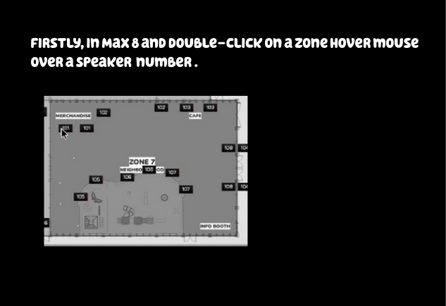
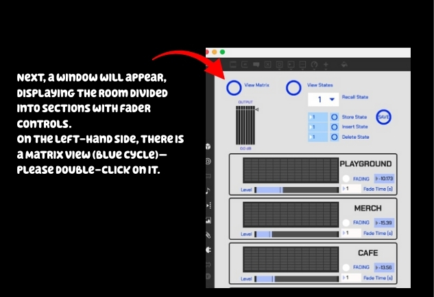
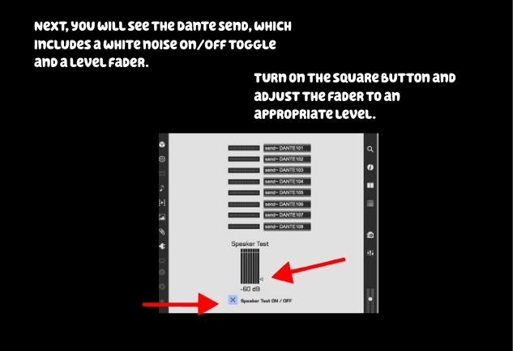

# 6.1.5 / Troubleshooting

Firstly, in Max 8 and double-click on a Zone.&#x20;

Next, a window will appear, displaying the room divided into sections with fader controls.&#x20;

On the left-hand side, there is a Matrix view (blue cycle)—please double-click on it.&#x20;

Next, you will see the Dante Send, which includes a white noise On/Off toggle and a level fader below. Turn on the square button and adjust the fader to an appropriate level.&#x20;

After completing these steps, you will hear white noise in the zone. It will play for approximately half a second on each speaker in sequence, and a red square will be displayed in Max 8. &#x20;

<figure><figcaption></figcaption></figure> <figure><figcaption></figcaption></figure> <figure><figcaption></figcaption></figure>

