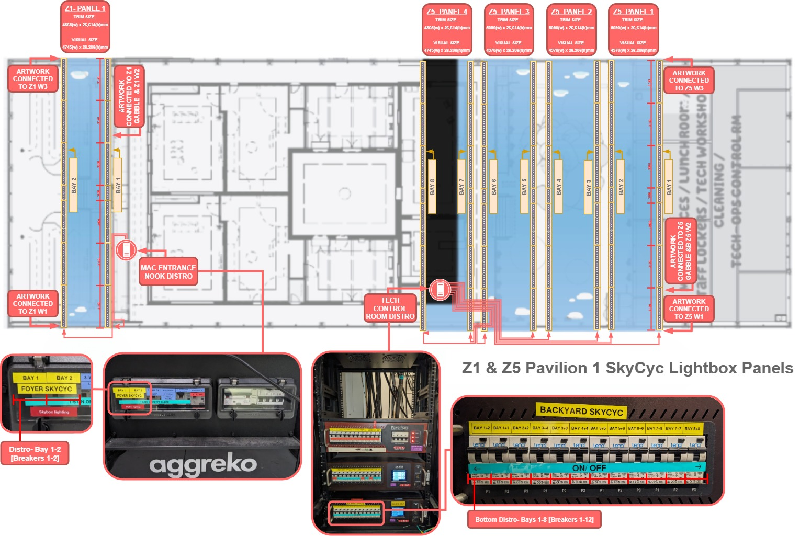
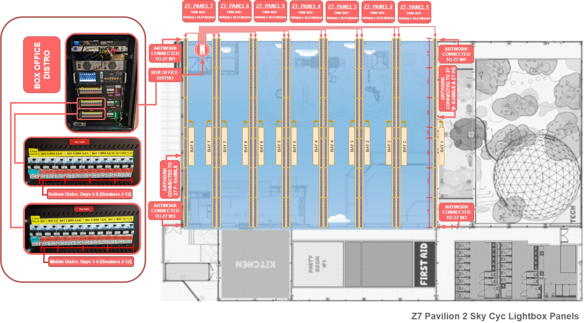

# 6.11.1 / Architecture

## System Plans



_Overview of projector equipment overlaid on venue map._

_\[Insert Plan Img]_



_Primary audio cable paths and connection points._

_\[Insert Plan Img]_



_Playback servers and input source locations._

_\[Insert Plan Img]_



_Comprehensive view of all audio equipment and connections_

_\[Insert Plan Img]_



## Zone Plans



 _Close-up of Zone 1 equipment and coverage._




_Close-up of Zone 2 equipment and coverage._

_\[ Insert Zoom In Photo of Zone 2 ]_



 _Close-up of Zone 3 equipment and coverage._

_\[ Insert Zoom In Photo of Zone 3 ]_



 _Close-up of Zone 4 equipment and coverage._

_\[ Insert Zoom In Photo of Zone 4 ]_



 _Close-up of Zone 5 equipment and coverage._

_\[ Insert Zoom In Photo of Zone 5 ]_



 _Close-up of Zone 6 equipment and coverage._

_\[ Insert Zoom In Photo of Zone 6 ]_



 _Close-up of Zone 7 equipment and coverage._

_\[ Insert Zoom In Photo of Zone 7 ]_



 _Close-up of Zone 8 equipment and coverage._

_\[ Insert Zoom In Photo of Zone 8 ]_





<figure><figcaption></figcaption></figure>



<figure><figcaption></figcaption></figure>



## Patch List

