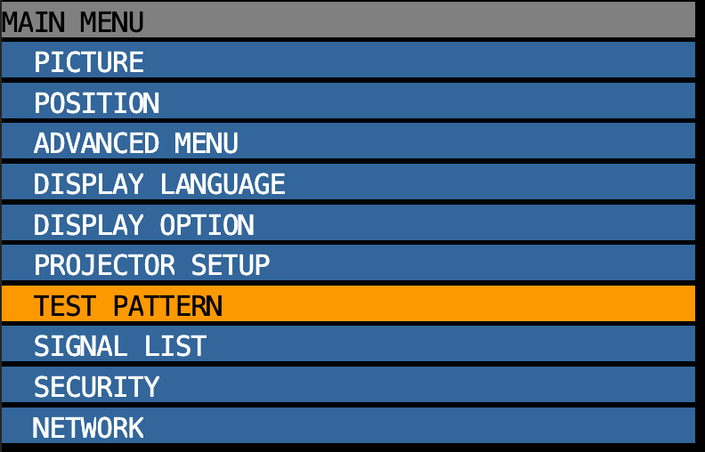
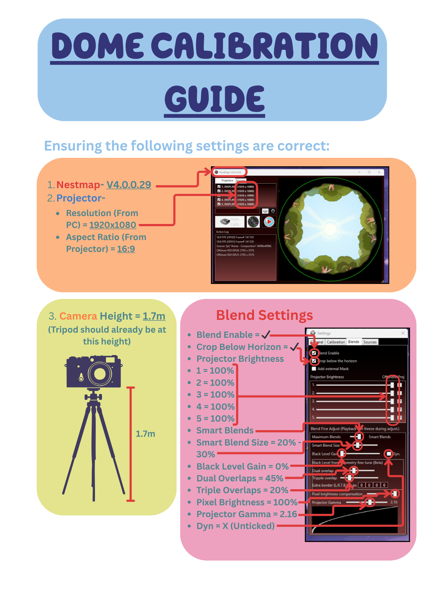
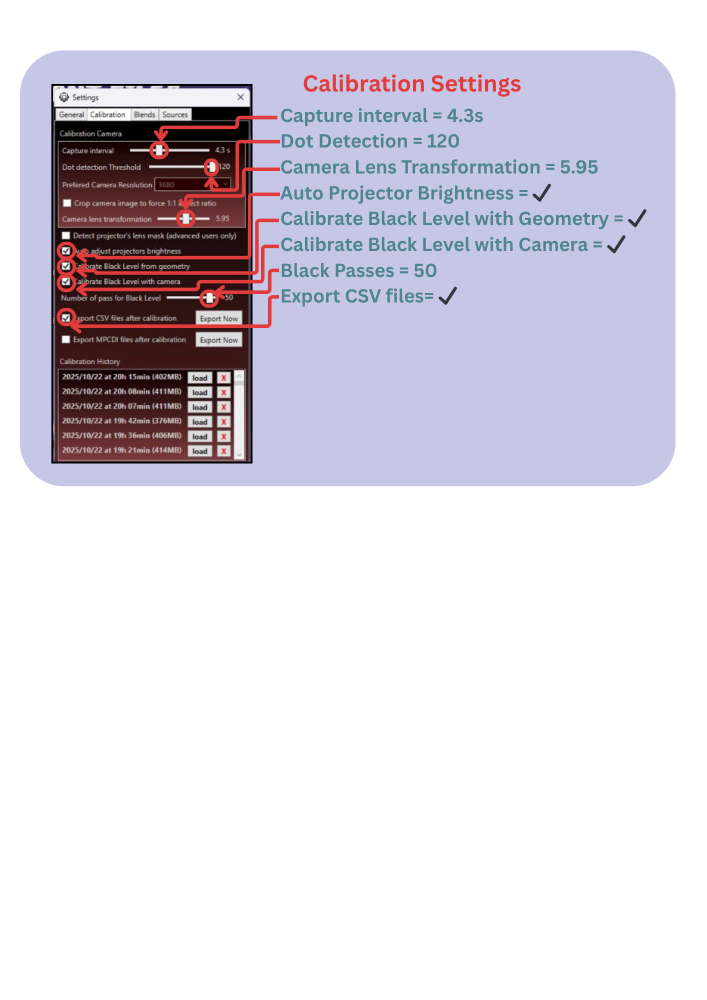

# 6.7.3.1 / Start Up

🌌 Dome

_Area overview: Projection, calibration, and LED systems used in the immersive Dome experience._

***

🧰 Hardware

#### 💻 Dome PC

* **Location:** Dome Nook
* **Login Access:** Via DW Service under `tech@akm.live`
* **Function:** Hosts NestMap and Resolume for projection control

#### 📽️ Projectors

* **5x Panasonic Projectors**
  * Mounted in timber projector plinths
  * Connected to Dome PC via **long HDMI cables** with **HDMI-to-DisplayPort converters**
* **Panasonic Remotes:**
  * Universal remotes used throughout the venue
  * Some remotes are locked to specific zones (Chattermax, Creek, Dome)
  * 🛠 If a remote isn’t working, try another — it may be assigned to a different area

#### 📸 Calibration Camera

* **Pixpro Orbital 360 Camera**
  * Located on a camera stand in the Dome Nook
  * Charger connected to Dome PC
  * Battery must be charged every **Sunday Close**
  * Always use **larger lens side** for calibration
  * ⚠️ _Lens cap has a surface scratch — remove it carefully before calibration_
  * **2x Spare lenses** available in the black cupboard, Tech Workshop

#### 📏 Camera/Mic Stand

* Used for raising the Pixpro camera to full height during calibration

***

💻 Software

* **NestMap:** Projection mapping software used to align visual content to irregular surfaces. In Bluey’s World, it manages multi-projector layouts like the Dome.

<figure><figcaption></figcaption></figure>

* **Resolume:** Media server and playback software for real-time video output. Controls content delivery to projectors.

<figure><figcaption></figcaption></figure>

* **Spout:** A video-sharing framework that enables real-time video streaming between applications (e.g., sending content from Resolume to NestMap).

<figure><figcaption></figcaption></figure>

***

🔄 Dome Opening Procedure

1. **Check projector distro power** in Dome Nook (labelled `XYZ`)
2. Use **Panasonic remote** — press `POWER ON`
   * Turn on **all 5 Dome projectors**, in order from 1 to 5
3. Wait for content to display

#### 🔍 Initial Visual Check

* In **NestMap**, select the **test pattern**
* Look for:
  * Crisp, aligned lines
  * No overlapping images
  * Sharp colours, no blurring or mismatching
* If the display is **fuzzy, repeated, or misaligned**, proceed with calibration

***

Dome Projector Setting and Trouble Shooting. 17/10/25-

Projectors may reroute, and positions numbered 1 through 5 may appear differently when activating the dome projectors during the Preshow set up. &#x20;

\- Verify the projector layout within the Nvidia Control Panel by navigating to "System" and selecting "View Projectors" under the "Output" settings.  &#x20;

\- Confirm each projector’s resolution in the Nvidia Desktop Application (e.g., 1920x1200).  &#x20;

\- Note that the desktop monitor’s resolution will differ from that of the projectors.  &#x20;

\- If necessary, refresh input configurations in NestMap, which is located above the projector array.&#x20;

&#x20;&#x20;

<figure><figcaption></figcaption></figure>

PROD-1 HIDM connected to Kramer Pico Tools PT-1C via the graphics card interface.  &#x20;

PT-1C is located in Dome Nook

.&#x20;

<figure><figcaption></figcaption></figure>

* Prod-2, 3, and 4 are connected to the AMX Enova DGX-1600 switcher via the AMX DxLink multi-format transmitter, mounted behind the projectors within the Dome.&#x20;

Front.&#x20;

&#x20;

<figure><figcaption></figcaption></figure>

Back. &#x20;

&#x20;

<figure><figcaption></figcaption></figure>

* Prod-1 is connected via AV Access HDBaseT utilizing one transmitter and one receiver. The transmitter is positioned at the rear of the projector, while the receiver is installed in the dome nook atop the rack.&#x20;

<figure><figcaption></figcaption></figure>

Frankenstein. 17.10.25&#x20;

🎯 Calibration- Quick Guide

<figure><figcaption></figcaption></figure>

<figure><figcaption></figcaption></figure>

🎯 Calibration

*   _**Only perform if visual check shows misalignment or poor clarity.**_

**🔧 Required Equipment**

* Tech Laptop
* Tech Ipad&#x20;
* PixPro Orbital 360 Camera
* Mic/Camera Stand

<figure><figcaption>
PIXPRO 360 
</figcaption></figure>

**🔧 Procedure**&#x20;

* Collect Tech Laptop (usually in Tech control room or techland/ Workshop)&#x20;
* Go to Dome Nook
* Turn off ‘Dome LED’ on distro (As labelled- Top rack, Breaker 1)
* Turn off ‘Work LX’ (As labelled- Aggreko Distro, Breaker 1)
* Collect (Pixpro) 3D camera, tripod stand & Calibration Signage
* Return to the dome
* Close entry & exit curtains and hang Calibration Signage on the outside
* Set up 3D camera in the middle of the dome (approx 20cm lower than projector lens’s)
* Retrieve cable from above bench seating (towards Dome nook) and behind ‘mountain’ skirting
* Plug into 3D camera and turn on (enure the display says ‘webcam’)
* Use Ipad to change lighting  (click ‘Tech’ button, click ‘lighting’ button, select ‘Pav2 Show LX’ or ‘Creek’)(don’t leave lighting in ‘Pav2 Work LX’- as there is light bleed into the dome)
* Use Laptop to remote into Dome PC (Turn on Laptop, Open Chrome, Open DWservice- in bookmark bar, click ‘[Tech@akm.live](mailto:Tech@akm.live)’ under ‘Account’, click ‘Shares’, select ‘Dome PC- New’)
* Open Nestmap
* Check drop down menu above ‘auto calibration’ button shows ‘Pixpro Orbit360’
* Click the play button and select ‘yes’ to stop playback&#x20;
* Click ‘test pattern’ button
* Click ‘Auto calibrate’
* Once Auto calibration is complete (7- 12mins), click on ‘test pattern’ to see if the calibration is clear \*(If the test pattern is blurry or doubled or looks bad in general- redo the ‘auto calibration’)
* Once the content looks good, click on playback button and Select ‘Okay’ (to save the calibration)
* Open to Resolume (if it is not already running)
* Click on content from the layer list in the last row, 1st column & drag the transport bar to the end & make sure the ‘play’ button is selected
* Use Ipad and play content (select ‘rehearsals’ button, click on ‘resume’ in the ‘Creek/ Dome’ row)
* Double check content visuals are clear (focus on bubble size & location, clarity of the content, mask location)
* Double check bubble alignment (the bubbles should roughly align above the speaker location of the audio, the ‘Bingo playing with Dominos’ bubble should roughly align above projector 1.)&#x20;
* If the bubbles need adjusting- Locate the 2nd ‘transform’ tab (Do not use the 1st ‘transform’ tab as this will adjust the fisheye & make the content not fit to the dome properly), click dropdown arrow, use rotate function to adjust bubbles left or right (plus\[+] or minus\[-])
* Double check the mask positioning (the black shadows around the base of the content- it should be just above the mountain skirting boards and roughly covering the door and projectors)
* If the mask needs adjusting- click on the mask content in the 2nd row (row above main content) & use the same 2nd ‘transform’ tab, click down arrow, use rotation function to adjust bubbles left or right (plus\[+] or minus\[-])
* The mask may be tilted to one side- use 2nd transform tab, click the dropdown arrow & use the axis function to tilt it right or left (plus\[+] or minus\[-])
* Reopen entry & exit curtains and take down Calibration Signage
* UnPlug into 3D camera and turn on (ensure the display says ‘webcam’)
* Return cable to above bench seating (towards Dome nook) and behind ‘mountain’ skirting
* Pack up 3D camera in the middle of the dome and return to the Dome nook area
* Turn ‘Dome LED’ on distro (As labelled- Top rack, Breaker 1)
* Put 3D Camera’s battery on charge (usually the charger is in the control room)
* Dome calibration and set up is complete

***

💡 Dome LED Strip

* **Power Location:** Dome Nook, `XYZ` distro — Breaker 5
* **Calibration Mode:**
  * **Turn LED OFF** before calibration
  * **Switch ON** after calibration is complete
* **Post-Calibration Check:**
  * Confirm **entire strip is same colour**
  * Observe **colour change** as part of the **Dome Sequence**

***

## 🪩 Chattermax

_Area overview: High-energy zone featuring projection, LED dance floor, and synced audio-visual show cues._

***

🧰 Hardware

#### 💻 Chattermax PC

* **Location:** Cubby Nook
* **Login Access:** Via DW Service under `tech@akm.live`
* **Function:** Hosts Madmapper for projection control

#### 📽️ Projectors

* **8x Panasonic Projectors**
  * Mounted to flown truss
  * Connected via HDMI to SDI Coverter into Chattermax PC via x2 Decklink Duo 2&#x20;
* **Panasonic Remotes:**
  * Universal remotes used throughout the venue
  * Some remotes are locked to specific zones (Chattermax, Creek, Dome)
  * 🛠 If a remote isn’t working, try another — it may be assigned to a different area

💻 Software

* **Madmapper:** Projection mapping and media server software which handles spatial calibration, content warping, and multi-projector blending. In Bluey’s World, it manages multi-projector layouts like the Chattermax and the Creek.

<figure><figcaption></figcaption></figure>

* **Decklink Duo Blackmagic:** Software desktop application — for verifying the functionality of the DecLink card.&#x20;

<figure><figcaption></figcaption></figure>

🔄 Chattermax Opening Procedure

1. **Check projector distro power** in Cubby Nook (labelled `PROJECTOR 1-8`)
2. Use **Panasonic remote** — press `POWER ON`
   * Turn on **all 8 Chattermax projectors**, in order from left to right
3. Wait for content to display ('curtain' content)

#### 🔍 Initial Visual Check

* In Madmapper, select the x8 quadrants
  * Click on 'output' tab (in top menu bar)
  * Select 'Full screen' mode
  * Select 'Vison' in the 1st column (central grid)
  * Click on 'Preview' tab (bottom right hand corner)
  * Drag the 'Position' transport bar to the end&#x20;
  * Insure the 'play' button is selected

- Look for:
  * Crisp, aligned lines
  * No overlapping images
  * Sharp colours, no blurring or mismatching
- If the display is **fuzzy, repeated, or misaligned**, proceed with calibration

## 🌲 Creek

_Area overview: Multi-projector environment with mapped visuals and interactive projection. Includes calibration and AV sync systems._
