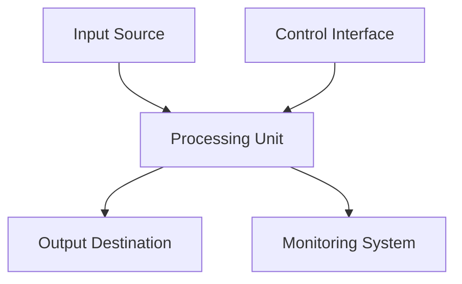

# 6.1.1 Architecture

## 6.1.1 Architecture

System Overview

The Audio System consists of [major components] configured to [accomplish specific tasks]. The system processes [inputs] to produce [outputs] for [end users/systems].

### Signal Flow

### Component Relationships

| Component | Connects To | Protocol/Interface | Notes |
| --------- | ----------- | ------------------ | ----- |
| Component A | Component B | Protocol X | Primary signal path |
| Component B | Component C | Protocol Y | Secondary processing |
| Component C | Component D | Protocol Z | Output distribution |



Details about the primary system configuration setup.



Details about the backup or redundant system configuration.



Special configuration for when the system is in maintenance mode.



