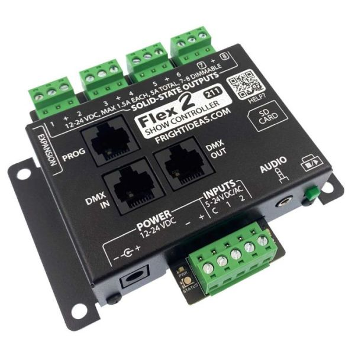

# 6.13.2 / Inventory

Sprite 4K Video Player

<figure><figcaption></figcaption></figure>

#### Included with the Sprite:

* 5V Power Supply
* RCA Video/Audio Cable
* Remote Control
* Trigger Input Adapter

The Sprite outputs video and audio to TVs and speakers, and are programmed to either activate on physical button press or timed in the show sequence (through a relay).

To change the settings of the Sprite, connect to a monitor/TV and use the remote to go through the menu.

Micro SD: Any Ambient file should be named 000. The triggered file should be named 001.

#### Manual:

<figure><figcaption></figcaption></figure>

Boo Box Flex 2 Show Controller

<figure><figcaption></figcaption></figure>

#### Specs:

* 16MB internal show memory
* Supports If This Then That logic
* High current solid-state outputs
* 2, 4, or 8 output models
* 2 Outputs can dim LEDs or small bulbs
* Pluggable terminal blocks
* Optional DMX output

Can be programmed using the Director software which is on the Tech (02DM Lighting) laptop, connected to the Flex2 (PROG input) using the Director Connect.

The software can retrieve the current programming directly from the Flex, or you can connect the SD card directly to the PC to view the current programmed file onboard.

#### Manual:

[https://www.frightideas.com/downloads/docs/BooBox\_Flex\_Quick\_Start\_v206s.pdf](https://www.frightideas.com/downloads/docs/BooBox_Flex_Quick_Start_v206s.pdf)

 

EscapeKeeper Puzzle Controller 504B

<figure><figcaption></figcaption></figure>

* Multiple Puzzle Modes
* 8 Puzzle Inputs, 1 Reset Input
* 1 Lock Output, 2 Programmable Outputs
* Pre-game Check and E-Stop Detection
* MP3 Audio, 35 watt Amp

#### Manual:

[https://www.frightideas.com/downloads/docs/EscapeKeeper\_Manual.pdf](https://www.frightideas.com/downloads/docs/EscapeKeeper_Manual.pdf)

To program the EscapeKeeper, refer to page 35 of the manual.

 

 
